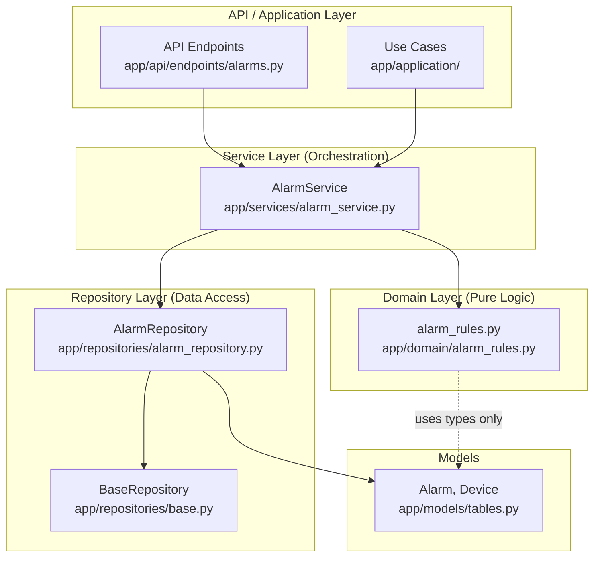

# Design Document: Service Layer Refactor (AlarmService Pilot)

## Overview

This design describes the extraction of business logic and data access from `AlarmService` into dedicated domain and repository modules, reducing the service to a thin orchestration layer. The refactoring follows the existing patterns established by `app/domain/energy_rules.py` (pure functions) and `app/repositories/base.py` (repository base class).

**Current state:** `AlarmService` (~500 lines) mixes fault detection rules, alarm lifecycle state transitions, database queries, and orchestration in a single class.

**Target state:** Three focused modules:
1. `app/domain/alarm_rules.py` — Pure functions for fault detection and alarm lifecycle transitions
2. `app/repositories/alarm_repository.py` — All alarm-related DB queries
3. `app/services/alarm_service.py` — Thin orchestration (domain → repository → side-effects)

The refactoring is incremental: AlarmService is the pilot, establishing conventions for subsequent extractions (EnergyService, FDDService).

## Architecture



**Orchestration pattern** (each AlarmService method):
1. Gather inputs (session, telemetry data, config)
2. Call domain functions for business decisions (pure, no I/O)
3. Call repository for persistence (queries, upserts)
4. Emit side-effects (logging, notifications)
5. Return results

## Components and Interfaces

### 1. Domain Module: `app/domain/alarm_rules.py`

Pure functions with no database or I/O imports. Follows the same pattern as `energy_rules.py`.

```python
# Public API

def evaluate_svg_faults(svg_data: dict) -> list[FaultDetection]:
    """Evaluate SVG telemetry for fault conditions."""

def evaluate_capacitor_bank_faults(
    cap_data: dict,
    profile_thresholds: CapacitorThresholds,
    rated_capacity: float,
) -> list[FaultDetection]:
    """Evaluate capacitor bank telemetry for fault conditions."""

def evaluate_threshold_faults(
    data: dict,
    thresholds: ThresholdConfig,
    device_category: str | None,
) -> list[FaultDetection]:
    """Evaluate generic threshold rules (voltage, current)."""

def compute_alarm_transition(
    detected_faults: list[FaultDetection],
    active_alarms: list[ActiveAlarmState],
    timestamp: datetime,
) -> AlarmTransitionPlan:
    """Determine create/refresh/recover transitions for a set of faults."""

def compute_resolve_transition(
    alarm_state: ActiveAlarmState,
    resolved_by: str,
    handling_note: str | None,
    timestamp: datetime,
) -> ResolveTransition:
    """Produce a resolve transition for a single alarm."""

def build_instance_key(device_id: int, category: str, source: str) -> str:
    """Construct stable alarm instance key."""

def infer_severity(message: str) -> str:
    """Infer alarm severity from message content."""
```

### 2. Repository Module: `app/repositories/alarm_repository.py`

Extends `BaseRepository`. All methods are `@staticmethod` accepting `Session`.

```python
class AlarmRepository(BaseRepository):

    @staticmethod
    def get_active_alarm(
        session: Session,
        device_id: int,
        category: str,
        source: str,
    ) -> Optional[Alarm]: ...

    @staticmethod
    def get_active_alarms_by_device(
        session: Session,
        device_id: int,
        source: str,
        categories: set[str],
    ) -> list[Alarm]: ...

    @staticmethod
    def create_alarm(session: Session, fields: AlarmCreateFields) -> Alarm: ...

    @staticmethod
    def update_alarm(session: Session, alarm: Alarm, fields: dict) -> Alarm: ...

    @staticmethod
    def list_alarms(
        session: Session,
        device_id: Optional[int] = None,
        resolved: Optional[bool] = None,
        start_time: Optional[datetime] = None,
        end_time: Optional[datetime] = None,
        limit: int = 100,
        allowed_device_ids: Optional[set[int]] = None,
    ) -> list[Alarm]: ...

    @staticmethod
    def get_unresolved_alarms(session: Session, limit: int = 20) -> list[Alarm]: ...

    @staticmethod
    def get_alarm_by_id(session: Session, alarm_id: int) -> Optional[Alarm]: ...

    @staticmethod
    def count_alarms(
        session: Session,
        device_id: Optional[int] = None,
        resolved: Optional[bool] = None,
    ) -> int: ...

    @staticmethod
    def get_device_rated_capacity(session: Session, device_id: int) -> Optional[float]: ...
```

### 3. Refactored Service: `app/services/alarm_service.py`

Thin orchestration only. No `select`/`where`/`exec` statements. No inline business rules.

```python
class AlarmService:
    # Constants preserved for backward compatibility
    SOURCE_DEVICE_NATIVE = "device_native"
    SOURCE_PLATFORM_RULE = "platform_rule"
    SOURCE_PLATFORM_COMM = "platform_comm"
    CATEGORY_COMMUNICATION_OFFLINE = "communication_offline"

    @staticmethod
    def check_svg_faults(session, device_id, svg_data, timestamp) -> list: ...

    @staticmethod
    def check_capacitor_bank_faults(session, device_id, cap_data, timestamp, profile_data=None) -> list[Alarm]: ...

    @staticmethod
    def check_and_create_alarm(session, device_id, data, timestamp) -> list: ...

    @staticmethod
    def resolve_alarm(session, alarm_id, resolved_by=None, handling_note=None, allowed_device_ids=None) -> bool: ...

    @staticmethod
    def resolve_all_alarms(session, resolved_by=None, handling_note=None, allowed_device_ids=None) -> int: ...

    # All other existing public methods preserved with same signatures
```

## Data Models

### Domain Input/Output Types (in `app/domain/alarm_rules.py`)

```python
from dataclasses import dataclass
from datetime import datetime
from typing import Optional


@dataclass(frozen=True)
class FaultDetection:
    """Result of evaluating a single fault rule."""
    category: str
    severity: str
    message: str
    source: str


@dataclass(frozen=True)
class CapacitorThresholds:
    """Threshold configuration for capacitor bank fault detection."""
    temperature_upper_limit: Optional[float] = None
    overvoltage_threshold: Optional[float] = None
    voltage_harmonic_threshold: Optional[float] = None
    current_harmonic_threshold: Optional[float] = None


@dataclass(frozen=True)
class ThresholdConfig:
    """Generic threshold configuration for voltage/current checks."""
    current_max: float = 45.0
    voltage_max: float = 250.0
    voltage_min: float = 190.0


@dataclass(frozen=True)
class ActiveAlarmState:
    """Snapshot of an active alarm for domain logic consumption."""
    id: int
    device_id: int
    instance_key: Optional[str]
    category: str
    source: str
    message: str
    severity: str
    timestamp: datetime
    last_seen_at: Optional[datetime]


@dataclass(frozen=True)
class AlarmCreateFields:
    """Fields needed to create a new alarm record."""
    device_id: int
    instance_key: str
    message: str
    severity: str
    category: str
    source: str
    timestamp: datetime
    last_seen_at: datetime


@dataclass(frozen=True)
class AlarmRefreshFields:
    """Fields to update when refreshing an existing alarm."""
    instance_key: str
    message: str
    severity: str
    last_seen_at: datetime


@dataclass(frozen=True)
class AlarmRecoverFields:
    """Fields to update when recovering an alarm."""
    recovered_at: datetime


@dataclass(frozen=True)
class ResolveTransition:
    """Fields to update when resolving an alarm."""
    is_resolved: bool
    resolved_at: datetime
    resolved_by: Optional[str]
    handling_note: Optional[str]


@dataclass(frozen=True)
class AlarmTransition:
    """A single alarm state transition."""
    action: str  # "create" | "refresh" | "recover"
    instance_key: str
    create_fields: Optional[AlarmCreateFields] = None
    refresh_fields: Optional[AlarmRefreshFields] = None
    recover_fields: Optional[AlarmRecoverFields] = None
    existing_alarm_id: Optional[int] = None


@dataclass(frozen=True)
class AlarmTransitionPlan:
    """Complete set of transitions for one fault-check cycle."""
    creates: list  # list[AlarmCreateFields]
    refreshes: list  # list[tuple[int, AlarmRefreshFields]]  (alarm_id, fields)
    recoveries: list  # list[tuple[int, AlarmRecoverFields]]  (alarm_id, fields)
```

### Mapping Between Layers

| Current AlarmService method | Domain function(s) | Repository method(s) |
|---|---|---|
| `check_svg_faults` | `evaluate_svg_faults` → `compute_alarm_transition` | `get_active_alarms_by_device`, `create_alarm`, `update_alarm` |
| `check_capacitor_bank_faults` | `evaluate_capacitor_bank_faults` → `compute_alarm_transition` | `get_active_alarms_by_device`, `create_alarm`, `update_alarm`, `get_device_rated_capacity` |
| `check_and_create_alarm` | `evaluate_threshold_faults` → `compute_alarm_transition` | `get_active_alarms_by_device`, `create_alarm`, `update_alarm` |
| `resolve_alarm` | `compute_resolve_transition` | `get_alarm_by_id`, `update_alarm` |
| `resolve_all_alarms` | `compute_resolve_transition` (per alarm) | `get_unresolved_alarms`, `update_alarm` |
| `list_alarms` | — (pass-through) | `list_alarms` |
| `get_unresolved_alarms` | — (pass-through) | `get_unresolved_alarms` |
| `upsert_active_alarm` | `compute_alarm_transition` | `get_active_alarm`, `create_alarm`/`update_alarm` |
| `mark_recovered_alarms` | `compute_alarm_transition` (recovery subset) | `get_active_alarms_by_device`, `update_alarm` |

