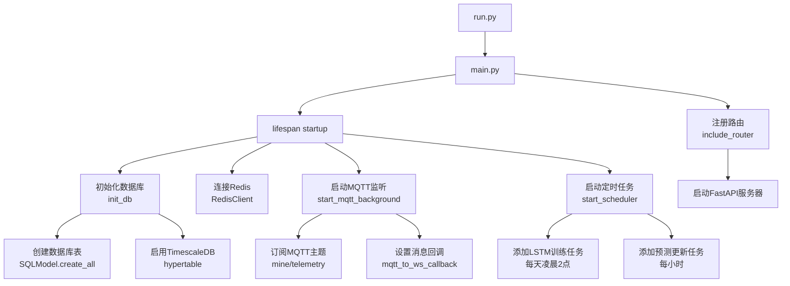
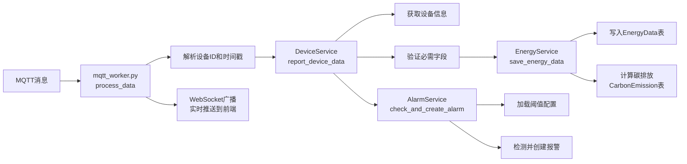
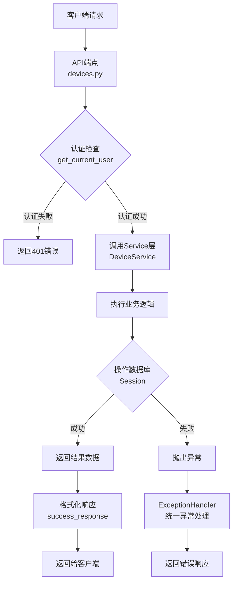
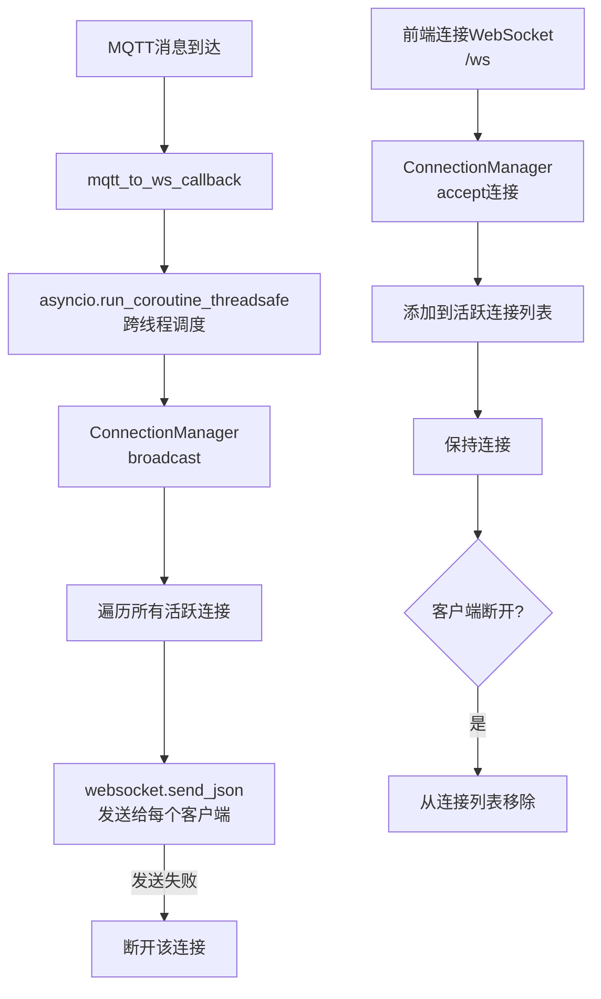
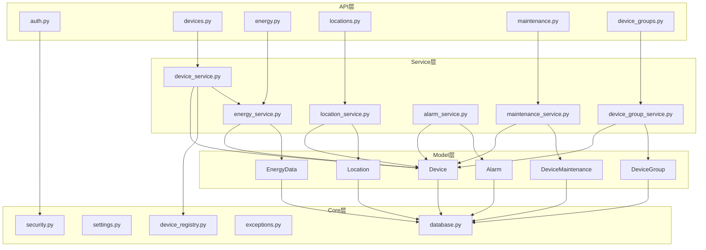

# 后端代码分析报告

## 📊 一、系统架构总览

### 1.1 整体架构
```
煤矿综合能源管理系统（FastAPI + TimescaleDB + MQTT）
│
├── 核心层（Core Layer）
│   ├── 配置管理: settings.py, config.py
│   ├── 数据库: database.py
│   ├── 安全认证: security.py
│   ├── 日志系统: logger.py
│   ├── Redis缓存: redis.py
│   ├── WebSocket: socket_manager.py
│   ├── 异常处理: exceptions.py, error_handlers.py
│   ├── 响应格式: response.py
│   └── 设备注册表: device_registry.py
│
├── 数据模型层（Model Layer）
│   └── tables.py: 所有数据库表定义
│       ├── Device（设备）
│       ├── DeviceData（电力遥测数据）⚠️ 
│       ├── EnergyData（通用能源数据）
│       ├── DeviceGroup（设备分组）
│       ├── Location（位置层级）
│       ├── DeviceMaintenance（维护记录）
│       ├── Alarm（报警）
│       ├── CarbonEmission（碳排放）
│       ├── EnergyStatistics（能源统计）
│       ├── Prediction（预测结果）
│       └── User（用户）
│
├── 业务逻辑层（Service Layer）
│   ├── device_service.py: 设备管理服务
│   ├── energy_service.py: 能源数据服务
│   ├── device_group_service.py: 设备分组服务
│   ├── location_service.py: 位置管理服务
│   ├── maintenance_service.py: 维护管理服务
│   ├── alarm_service.py: 报警管理服务
│   ├── data_processor.py: 数据处理器 ⚠️
│   ├── mqtt_worker.py: MQTT消息监听
│   ├── mqtt_publisher.py: MQTT命令下发
│   ├── scheduler_service.py: 定时任务调度
│   ├── forecast_adapter.py: 预测适配器
│   ├── analysis_service.py: 数据分析服务
│   └── fdd_service.py: 故障诊断服务
│
├── API端点层（API Layer）
│   ├── auth.py: 用户认证
│   ├── devices.py: 设备管理
│   ├── energy.py: 多能源管理
│   ├── telemetry.py: 遥测数据 ⚠️
│   ├── device_groups.py: 设备分组
│   ├── locations.py: 位置管理
│   ├── maintenance.py: 维护管理
│   ├── alarms.py: 报警管理
│   ├── analysis.py: 数据分析
│   ├── fdd.py: 故障诊断
│   ├── forecast.py: 负荷预测
│   ├── reports.py: 报表导出
│   ├── data_generator.py: 数据生成器
│   └── health.py: 健康检查
│
└── 应用入口（Entry Point）
    └── main.py: FastAPI应用主入口
```

## 🔴 二、发现的冗余代码

### 2.1 数据模型冗余

#### 问题1: DeviceData 和 EnergyData 功能重叠

**DeviceData表**（app/models/tables.py:135-148）
```python
class DeviceData(SQLModel, table=True):
    """设备遥测数据（时序表）- 电力数据"""
    device_id: int
    timestamp: datetime
    voltage: float
    current: float
    power: float
    energy: float
```

**EnergyData表**（app/models/tables.py:150-181）
```python
class EnergyData(SQLModel, table=True):
    """通用能源数据表（时序表）- 支持多种能源类型"""
    device_id: int
    timestamp: datetime
    energy_type: str
    consumption: float
    flow_rate: Optional[float]
    # 电力专用字段
    voltage: Optional[float]
    current: Optional[float]
    power_factor: Optional[float]
    # 还支持水、气、热等字段
```

**分析**:
- DeviceData 只支持电力数据（voltage, current, power, energy）
- EnergyData 是通用能源数据表，支持电力、水、气、热等多种能源
- EnergyData 完全可以覆盖 DeviceData 的功能
- 当前系统中两个表都在使用，造成数据存储和查询的混乱

**建议**: 
- **统一使用 EnergyData 表**
- 删除 DeviceData 表定义
- 迁移现有 DeviceData 数据到 EnergyData

### 2.2 数据处理入口冗余

#### 问题2: 多个数据上报入口

**入口1**: `app/services/data_processor.py` + `app/api/endpoints/telemetry.py`
```python
# data_processor.py: 处理电力设备数据
def process_device_data(session, device_id, voltage, current, power, energy, timestamp):
    # 写入 DeviceData 表
    # 触发报警检测
    pass

# telemetry.py: 旧的遥测数据上报端点
@router.post("/")
def upload_telemetry(data: DeviceData, session):
    return process_device_data(...)  # 使用 data_processor
```

**入口2**: `app/services/device_service.py` + `app/api/endpoints/devices.py`
```python
# device_service.py: 新的统一数据上报接口
def report_device_data(session, device_id, data, timestamp):
    # 支持所有能源类型
    # 调用 EnergyService.save_energy_data()
    # 写入 EnergyData 表
    pass

# devices.py: 新的设备数据上报端点
@router.post("/{device_id}/data")
def report_device_data(device_id, req, session):
    return DeviceService.report_device_data(...)
```

**分析**:
- 存在两套数据上报逻辑，功能重叠
- `telemetry.py` + `data_processor.py` 是旧的实现（只支持电力数据）
- `devices.py` + `device_service.py` 是新的统一实现（支持所有能源）
- 两套系统并存，容易造成混乱

**建议**:
- **保留** `DeviceService.report_device_data()` 作为统一入口
- **删除** `data_processor.py` 和 `telemetry.py` 旧的端点
- MQTT worker 调用统一的 `DeviceService.report_device_data()`

### 2.3 配置管理冗余

#### 问题3: settings.py 和 config.py 职责重叠

**settings.py** (app/core/settings.py)
```python
class Settings(BaseSettings):
    """应用配置类 - 从环境变量和.env文件加载"""
    database_url: str
    redis_url: str
    mqtt_broker: str
    mqtt_port: int
    secret_key: str
    # ... 所有配置项
```

**config.py** (app/core/config.py)
```python
def load_thresholds() -> dict[str, Any]:
    """加载阈值配置（读取 config/settings.json）"""
    path = settings.settings_json_path or "config/settings.json"
    return json.load(open(path))
```

**分析**:
- `settings.py` 管理环境变量配置
- `config.py` 只用于加载JSON配置文件（报警阈值等）
- `config.py` 功能单一，可以合并到其他模块

**建议**:
- 将 `load_thresholds()` 函数移到 `alarm_service.py` 中
- 删除 `config.py` 文件

### 2.4 其他小问题

#### 问题4: scheduler_service.py 中未定义的引用

```python
# 第95行使用了 LSTMAdapter，但没有定义
lstm_adapter = LSTMAdapter()  # ❌ NameError
```

**建议**: 修正为 `ForecastAdapter`

#### 问题5: 日志中的重复配置

`logger.py` 中配置了两个文件输出，但都指向同一个目录，可以优化。

## ✅ 三、建议的清理方案

### 3.1 删除冗余文件

建议删除以下文件：

```bash
# 删除旧的电力数据处理模块
rm app/services/data_processor.py
rm app/api/endpoints/telemetry.py

# 删除冗余的配置模块
rm app/core/config.py
```

### 3.2 修改数据模型

**修改 `app/models/tables.py`**:
```python
# 删除 DeviceData 表定义（第135-148行）
# 只保留 EnergyData 表

# 如果需要兼容旧代码，可以创建一个别名：
# DeviceData = EnergyData  # 临时兼容
```

### 3.3 迁移 data_processor 逻辑

将报警检测逻辑从 `data_processor.py` 迁移到 `alarm_service.py`:

```python
# app/services/alarm_service.py

class AlarmService:
    
    @staticmethod
    def load_thresholds() -> dict:
        """加载报警阈值配置"""
        from app.core.settings import settings
        import json
        path = settings.settings_json_path or "config/settings.json"
        try:
            with open(path, "r") as f:
                return json.load(f)
        except:
            return {}
    
    @staticmethod
    def check_and_create_alarm(
        session: Session,
        device_id: int,
        data: dict,
        timestamp: datetime
    ) -> List[Alarm]:
        """检查数据并创建报警"""
        alarms = []
        cfg = AlarmService.load_thresholds()
        defaults = cfg.get("default", {})
        dev_cfg = cfg.get("device_thresholds", {}).get(str(device_id), {})
        
        # 电流过载检测
        if "current" in data:
            current = data["current"]
            limit = dev_cfg.get("current_max", defaults.get("current_max", 45.0))
            if current > limit:
                alarm = AlarmService.create_alarm(
                    session, device_id,
                    f"⚠️ 过载报警! 当前: {current}A (上限: {limit}A)",
                    timestamp
                )
                alarms.append(alarm)
        
        # 电压异常检测
        if "voltage" in data:
            voltage = data["voltage"]
            v_max = defaults.get("voltage_max", 250.0)
            v_min = defaults.get("voltage_min", 190.0)
            if voltage > v_max or voltage < v_min:
                alarm = AlarmService.create_alarm(
                    session, device_id,
                    f"⚡ 电压异常! 读数: {voltage}V",
                    timestamp
                )
                alarms.append(alarm)
        
        return alarms
```

### 3.4 修改 MQTT Worker

```python
# app/services/mqtt_worker.py

def process_data(payload_str, topic=None, broadcast_callback=None):
    """处理一条 MQTT 消息"""
    try:
        data = json.loads(payload_str)
        device_id = _resolve_device_id(data, topic)
        if not device_id:
            return None
        
        ts = _parse_timestamp(data)
        
        with Session(engine) as session:
            # 使用统一的设备数据上报接口
            from app.services.device_service import DeviceService
            record = DeviceService.report_device_data(
                session=session,
                device_id=device_id,
                data=data,
                timestamp=ts
            )
            
            # 检查并创建报警
            from app.services.alarm_service import AlarmService
            AlarmService.check_and_create_alarm(
                session, device_id, data, ts
            )
        
        # WebSocket广播
        if broadcast_callback:
            ws_msg = {
                "type": "telemetry_update",
                "data": {
                    "device_id": device_id,
                    "timestamp": record.timestamp.isoformat(),
                    **data
                }
            }
            broadcast_callback(ws_msg)
        
        return record
    except Exception as e:
        logger.error(f"处理MQTT消息失败: {e}")
        return None
```

### 3.5 数据库迁移脚本

```python
# scripts/python/migrate_devicedata_to_energydata.py
"""
将 DeviceData 表的数据迁移到 EnergyData 表
"""
from sqlmodel import Session, select
from app.core.database import engine
from app.models.tables import DeviceData, EnergyData, Device, EnergyType

def migrate():
    with Session(engine) as session:
        # 查询所有 DeviceData 记录
        statement = select(DeviceData)
        device_data_records = session.exec(statement).all()
        
        print(f"找到 {len(device_data_records)} 条 DeviceData 记录")
        
        count = 0
        for record in device_data_records:
            # 获取设备信息
            device = session.get(Device, record.device_id)
            if not device:
                continue
            
            # 检查是否已存在
            existing = session.exec(
                select(EnergyData).where(
                    EnergyData.device_id == record.device_id,
                    EnergyData.timestamp == record.timestamp
                )
            ).first()
            
            if existing:
                continue
            
            # 创建 EnergyData 记录
            energy_data = EnergyData(
                device_id=record.device_id,
                timestamp=record.timestamp,
                energy_type=EnergyType.ELECTRICITY,
                consumption=record.energy,
                flow_rate=record.power,
                voltage=record.voltage,
                current=record.current
            )
            
            session.add(energy_data)
            count += 1
            
            if count % 1000 == 0:
                session.commit()
                print(f"已迁移 {count} 条记录...")
        
        session.commit()
        print(f"✅ 迁移完成！共迁移 {count} 条记录")

if __name__ == "__main__":
    migrate()
```

## 📊 四、完整的调用流程图

### 4.1 应用启动流程



### 4.2 设备数据上报流程（推荐的统一方式）



### 4.3 API请求流程（以设备管理为例）



### 4.4 WebSocket实时推送流程



### 4.5 各层级模块调用关系



### 4.6 关键功能模块详细流程

#### 4.6.1 设备创建流程

```
客户端 
  ↓ POST /devices/
devices.py:create_device_smart()
  ↓ 
DeviceService.create_device_smart()
  ├── device_registry.get(device_type) → 获取设备类型配置
  ├── 检查序列号是否重复
  ├── 自动填充字段（energy_type, device_category, unit等）
  └── session.add(device) + commit
  ↓
返回创建的设备对象
```

#### 4.6.2 能源数据查询流程

```
客户端
  ↓ GET /energy/data/{device_id}?start_time=xxx&end_time=xxx
energy.py:get_energy_data()
  ↓
EnergyService.get_energy_data()
  ├── 构建SQL查询（device_id, energy_type, 时间范围）
  ├── 排序（timestamp DESC）
  └── 限制条数（limit）
  ↓
返回 EnergyData 列表
```

#### 4.6.3 位置层级查询流程

```
客户端
  ↓ GET /locations/tree
locations.py:get_location_tree()
  ↓
LocationService.get_location_tree()
  ├── 获取根位置（parent_id = NULL）
  └── 递归构建树形结构
      ├── 获取子位置
      ├── 统计设备数量
      └── 继续递归子节点
  ↓
返回树形结构JSON
```

#### 4.6.4 设备分组管理流程

```
客户端
  ↓ POST /device-groups/{group_id}/devices
device_groups.py:add_devices_to_group()
  ↓
DeviceGroupService.batch_add_devices_to_group()
  ├── 验证分组存在
  └── 遍历设备ID列表
      ├── 验证设备存在
      ├── 检查是否已在分组中
      └── 创建 DeviceGroupMembership 记录
  ↓
返回成功添加的数量
```

#### 4.6.5 维护记录管理流程

```
客户端
  ↓ POST /maintenance/
maintenance.py:create_maintenance_record()
  ↓
MaintenanceService.create_maintenance()
  ├── 验证设备存在
  ├── 验证维护类型
  └── 创建 DeviceMaintenance 记录（状态=SCHEDULED）
  ↓
返回维护记录
  
后续操作：
  ├── POST /maintenance/{id}/start → 开始维护（状态=IN_PROGRESS）
  ├── POST /maintenance/{id}/complete → 完成维护（状态=COMPLETED）
  └── GET /maintenance/upcoming → 查询即将到来的维护计划
```

## 🎯 五、优化建议总结

### 5.1 立即执行的清理

1. **删除冗余数据模型**
   - 删除 `DeviceData` 表，统一使用 `EnergyData`
   - 执行数据迁移脚本

2. **统一数据上报入口**
   - 删除 `data_processor.py` 和 `telemetry.py`
   - 所有数据上报使用 `DeviceService.report_device_data()`

3. **合并配置管理**
   - 删除 `config.py`
   - 将 `load_thresholds()` 移到 `AlarmService`

4. **修复错误引用**
   - 修正 `scheduler_service.py` 中的 `LSTMAdapter` 引用

### 5.2 代码质量提升

1. **添加类型注解**
   - 补充完整的类型注解（Type Hints）
   - 提高代码可读性和IDE支持

2. **统一错误处理**
   - 所有Service层方法统一使用自定义异常
   - 避免直接抛出通用异常

3. **优化日志记录**
   - 统一日志格式
   - 添加更多关键操作的日志

4. **补充单元测试**
   - 为核心Service添加单元测试
   - 提高代码覆盖率

### 5.3 性能优化

1. **数据库查询优化**
   - 添加必要的索引
   - 使用批量操作减少数据库往返

2. **缓存策略**
   - 设备类型配置可以缓存到Redis
   - 减少频繁的数据库查询

3. **异步优化**
   - 将同步的MQTT发布改为异步
   - WebSocket广播使用异步队列

## 📝 六、清理执行清单

### 阶段一：数据迁移（必须先执行）

- [ ] 执行 `migrate_devicedata_to_energydata.py` 脚本
- [ ] 验证数据迁移完整性
- [ ] 备份原始数据

### 阶段二：代码修改

- [ ] 修改 `app/models/tables.py` - 删除 DeviceData 表定义
- [ ] 修改 `app/services/alarm_service.py` - 添加报警检测逻辑
- [ ] 修改 `app/services/mqtt_worker.py` - 使用统一数据上报接口
- [ ] 修改 `app/services/scheduler_service.py` - 修正 LSTMAdapter 引用
- [ ] 删除 `app/services/data_processor.py`
- [ ] 删除 `app/api/endpoints/telemetry.py`
- [ ] 删除 `app/core/config.py`
- [ ] 修改 `app/main.py` - 移除 telemetry 路由注册

### 阶段三：测试验证

- [ ] 测试设备数据上报功能
- [ ] 测试MQTT消息处理
- [ ] 测试WebSocket实时推送
- [ ] 测试报警功能
- [ ] 测试所有API端点

### 阶段四：文档更新

- [ ] 更新API文档
- [ ] 更新数据库设计文档
- [ ] 更新部署文档

## 📄 附录：文件清单

### 核心文件（保留）
- ✅ `app/main.py` - 应用入口
- ✅ `app/core/database.py` - 数据库管理
- ✅ `app/core/settings.py` - 配置管理
- ✅ `app/core/security.py` - 安全认证
- ✅ `app/core/logger.py` - 日志系统
- ✅ `app/core/redis.py` - Redis客户端
- ✅ `app/core/socket_manager.py` - WebSocket管理
- ✅ `app/core/exceptions.py` - 异常定义
- ✅ `app/core/response.py` - 响应格式
- ✅ `app/core/error_handlers.py` - 异常处理器
- ✅ `app/core/device_registry.py` - 设备注册表

### 数据模型（保留，需修改）
- ⚠️ `app/models/tables.py` - 需删除 DeviceData 定义

### 业务服务（保留）
- ✅ `app/services/device_service.py`
- ✅ `app/services/energy_service.py`
- ✅ `app/services/device_group_service.py`
- ✅ `app/services/location_service.py`
- ✅ `app/services/maintenance_service.py`
- ✅ `app/services/alarm_service.py`
- ⚠️ `app/services/mqtt_worker.py` - 需修改
- ✅ `app/services/mqtt_publisher.py`
- ⚠️ `app/services/scheduler_service.py` - 需修改
- ✅ `app/services/forecast_adapter.py`
- ✅ `app/services/analysis_service.py`
- ✅ `app/services/fdd_service.py`

### API端点（部分需删除）
- ✅ `app/api/deps.py`
- ✅ `app/api/endpoints/auth.py`
- ✅ `app/api/endpoints/devices.py`
- ✅ `app/api/endpoints/energy.py`
- ❌ `app/api/endpoints/telemetry.py` - 需删除
- ✅ `app/api/endpoints/device_groups.py`
- ✅ `app/api/endpoints/locations.py`
- ✅ `app/api/endpoints/maintenance.py`
- ✅ `app/api/endpoints/alarms.py`
- ✅ `app/api/endpoints/analysis.py`
- ✅ `app/api/endpoints/fdd.py`
- ✅ `app/api/endpoints/forecast.py`
- ✅ `app/api/endpoints/reports.py`
- ✅ `app/api/endpoints/data_generator.py`
- ✅ `app/api/endpoints/health.py`

### 需删除的文件
- ❌ `app/services/data_processor.py`
- ❌ `app/api/endpoints/telemetry.py`
- ❌ `app/core/config.py`

---

**生成时间**: 2026-01-24
**系统版本**: 2.0.0
**文档作者**: AI Assistant
