# 后端系统调用流程图详解

## 📊 1. 系统总体架构图

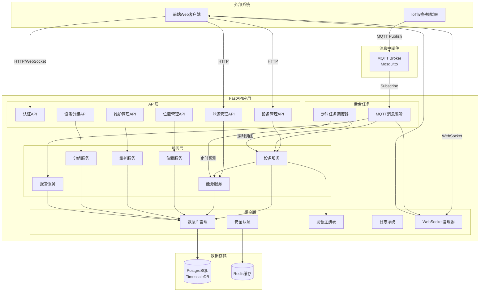

## 🔄 2. 核心业务流程

### 2.1 用户登录认证流程

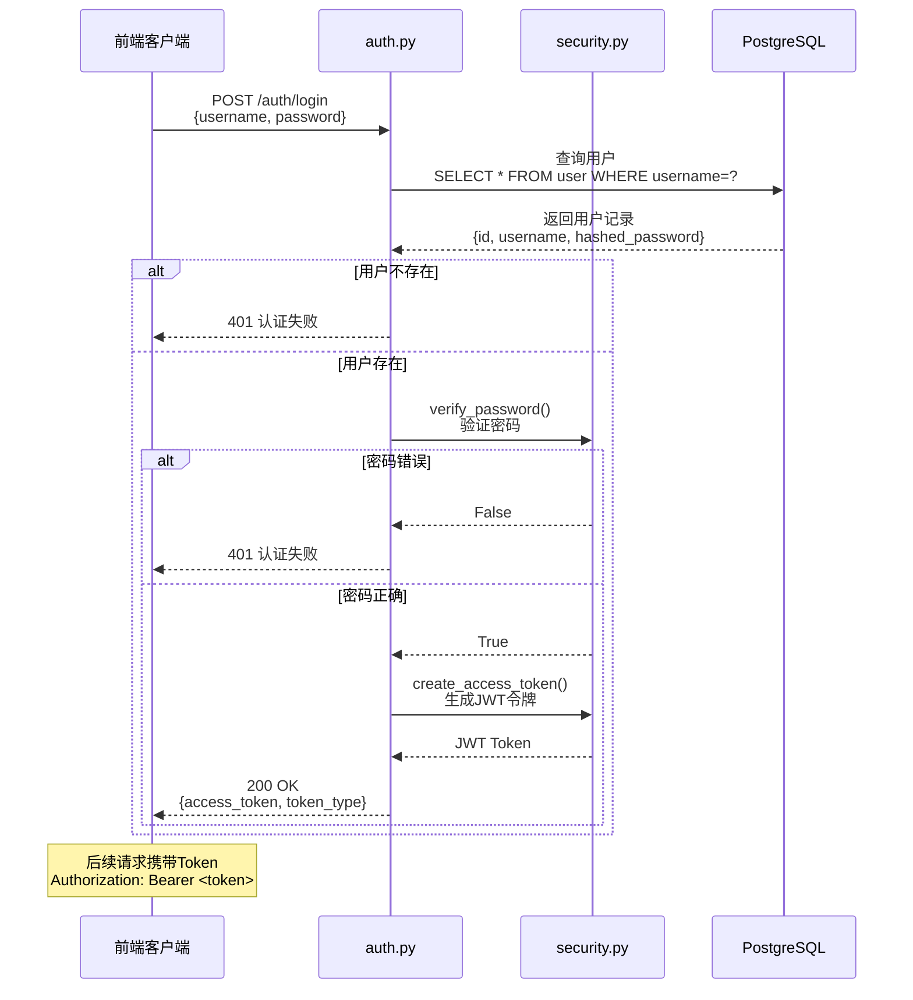

### 2.2 设备数据上报完整流程（推荐）

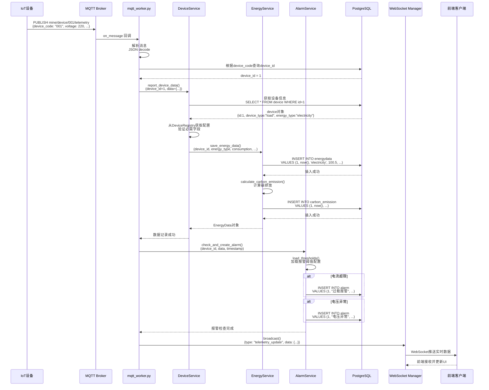

### 2.3 设备创建流程

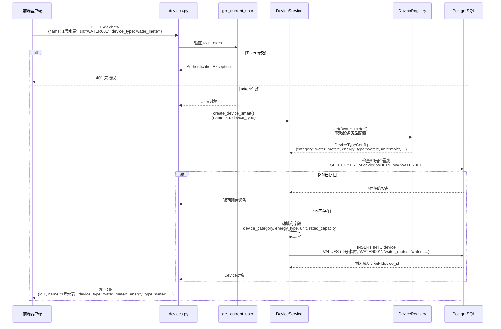

### 2.4 位置层级管理流程

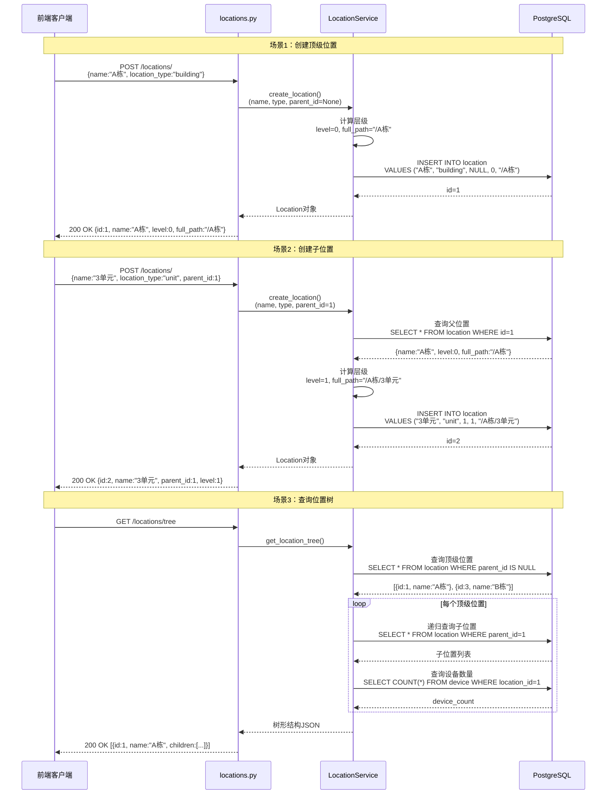

### 2.5 设备分组管理流程

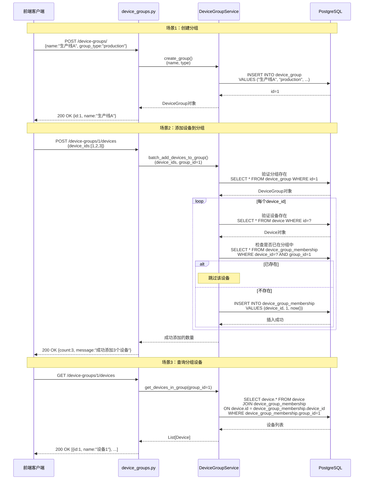

### 2.6 设备维护管理流程

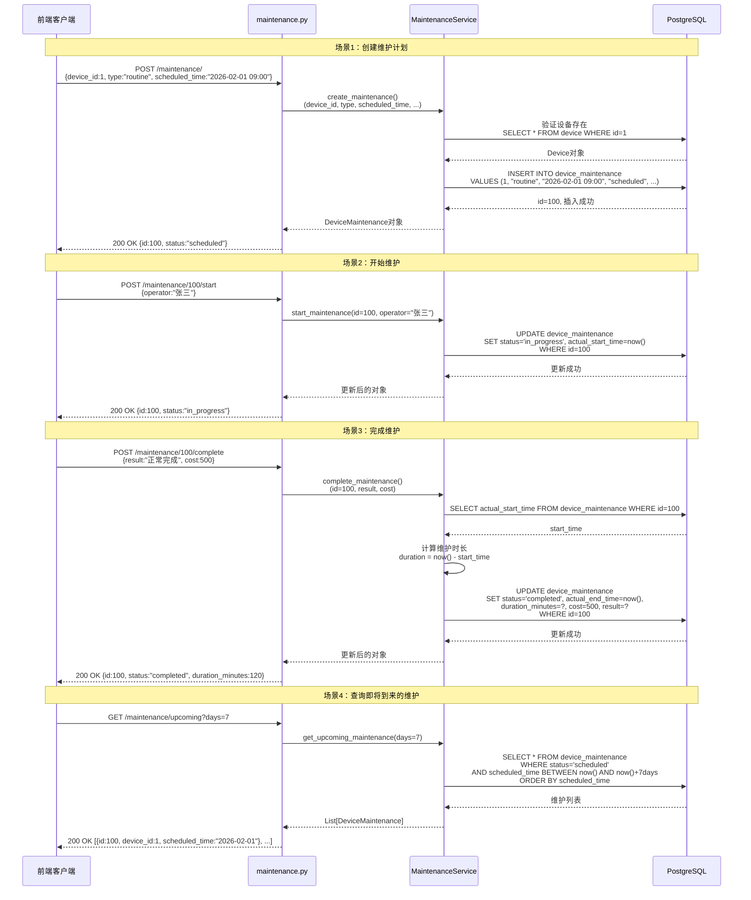

## ⚙️ 3. 后台任务流程

### 3.1 MQTT消息监听流程

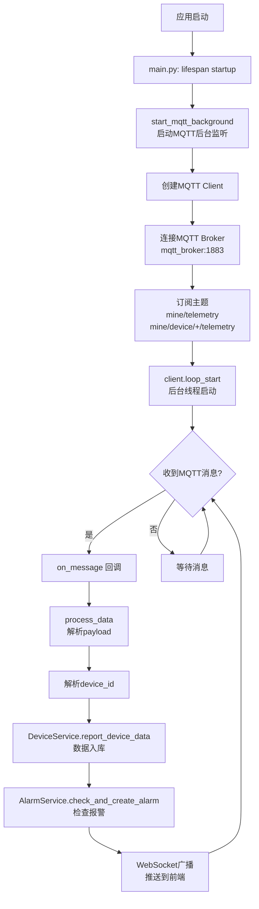

### 3.2 定时任务调度流程

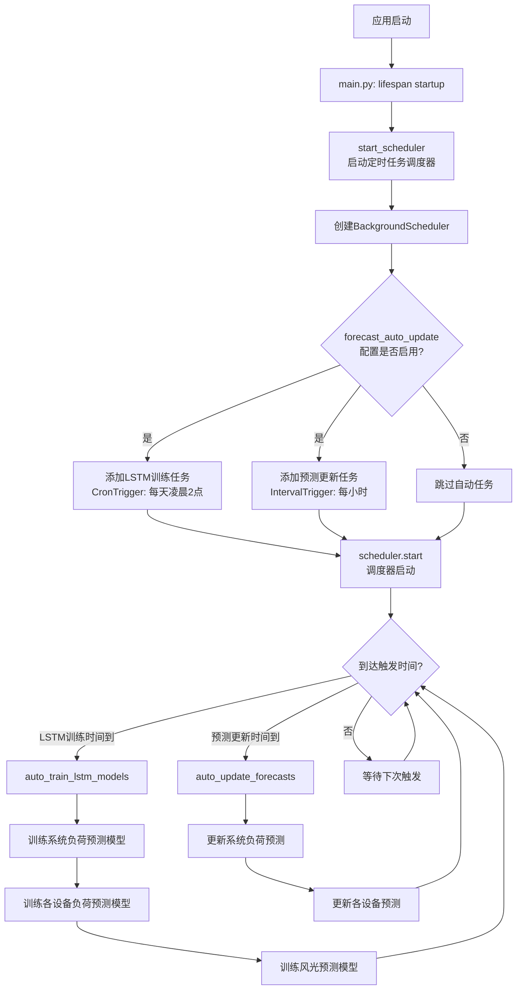

### 3.3 WebSocket实时推送流程

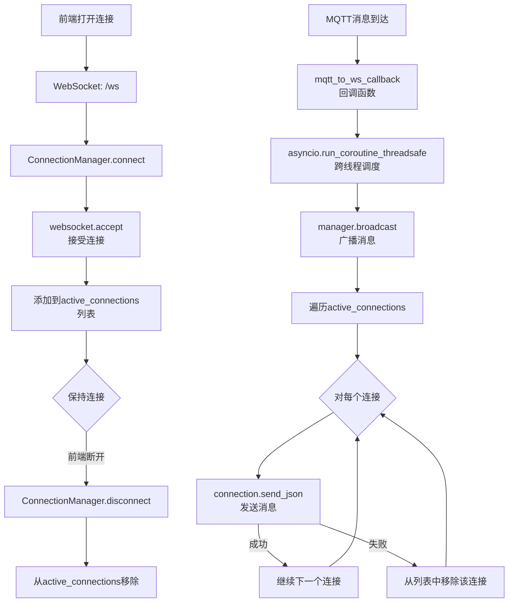

## 🔗 4. 数据库表关系图

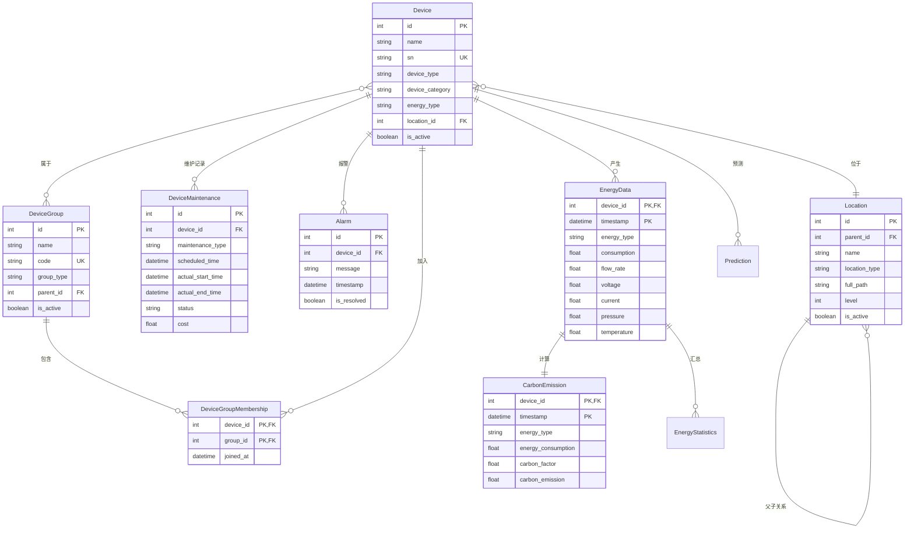

## 📝 5. 关键模块依赖关系

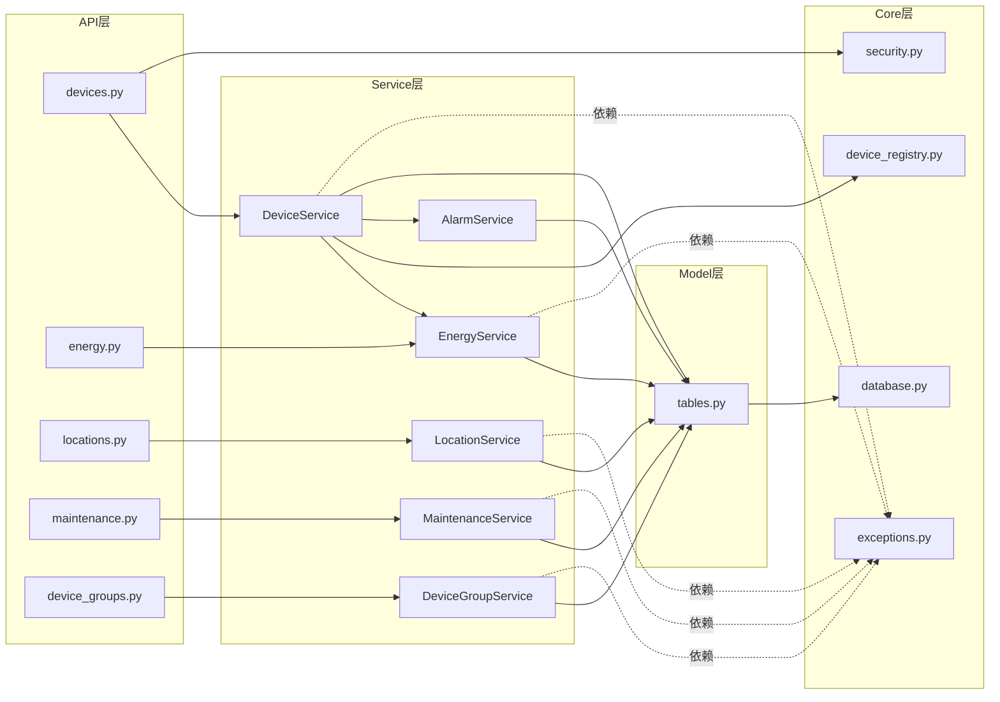

## 🎯 6. 数据流向总览

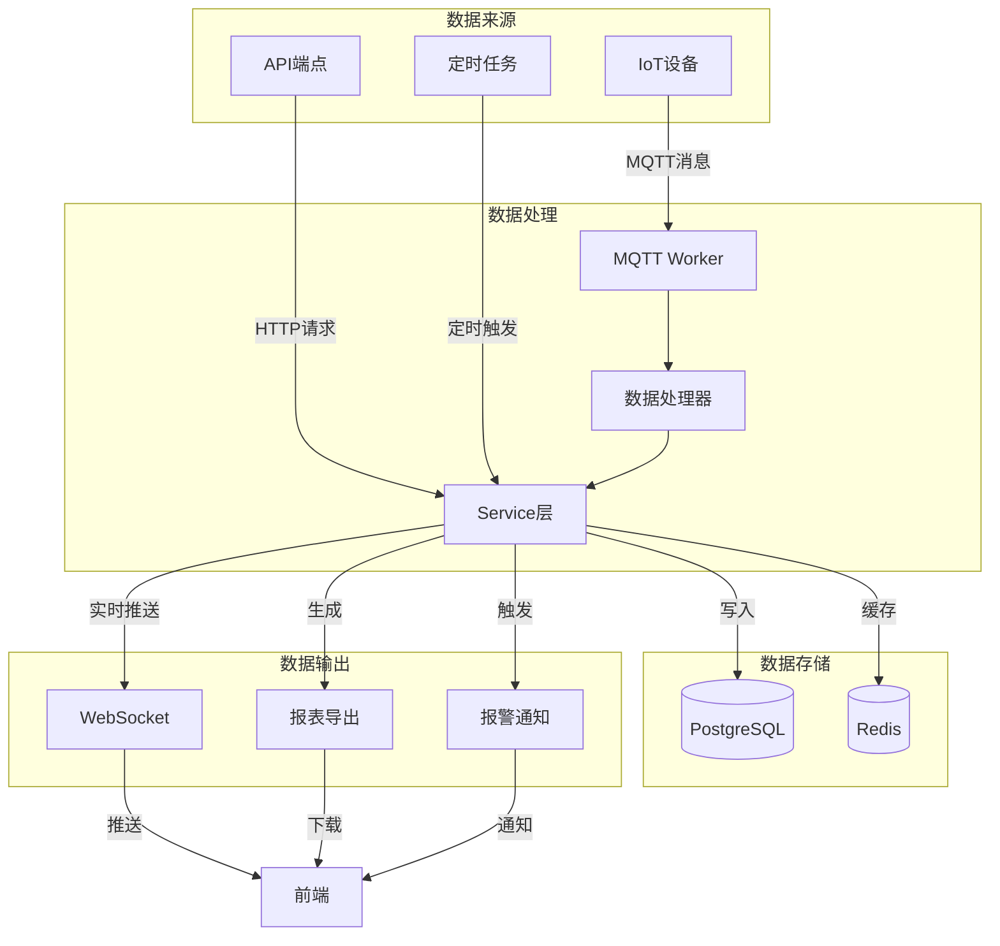

---

**说明**：
- 使用Mermaid语法绘制，可在支持Mermaid的Markdown编辑器中查看
- 如果你已经在编辑器（如 VS Code、Typora 等）安装了Markdown插件或Mermaid插件，打开本文件（`.md`格式）即可自动识别和渲染Markdown内容以及流程图。
- 在VS Code中，可以通过快捷键<kbd>Ctrl+Shift+V</kbd>（或右键选择“Markdown: Open Preview”）实时预览效果。带有Mermaid流程图的代码块会自动渲染为图表。
- 只需正常打开或保存文件，无需额外“调用”操作，编辑器会自动解析Markdown格式及Mermaid语法。
- 所有流程图均基于实际代码分析绘制，反映系统真实架构
