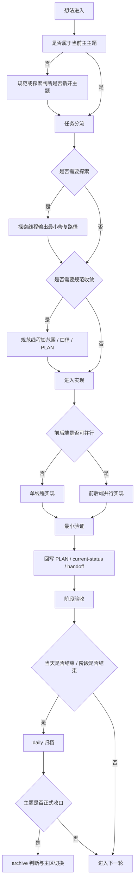

# Codex 五线程 Vibe Coding 框架

> 适用于个人在 Codex 中使用“验收 / 后端 / 前端 / 规范 / 探索”五线程持续推进高频开发。本文是 [AI 多线程协作 SOP](./ai-collaboration-sop.md) 的执行层补充：SOP 管治理、归档与收口，本文管任务分流、线程切换、并行边界与单轮闭环。

---

## 1. 当前流程定位

### 1.1 仓库里已经存在的治理层规则

- `AGENTS.md` 已定义产品定位、线程职责、基础工作顺序和输出格式。
- `docs/guides/ai-collaboration-sop.md` 已定义立项、主区维护、daily 归档、主题收口和 archive 迁移。
- `docs/guides/变更计划规范.md` 已定义何时必须先写 `PLAN-*.md`。
- `docs/plans/current-status.md` 与 `docs/plans/handoff.md` 已形成“当前态 / 当前交接”双入口。
- `docs/plans/daily/` 与 `docs/archive/plans/` 已形成历史快照和主题归档出口。

### 1.2 当前还缺的高频开发层规则

- 新任务进入后，缺少一套“先走哪几个线程”的默认判断。
- 缺少“探索线程输出默认分两层：主区必写、专题才写”的硬规则。
- 缺少“什么时候可以跳过探索或规范”的轻量规则。
- 缺少“什么时候必须停止当前线程并交给下一线程”的切换闸门。
- 缺少“前后端什么时候可以并行，什么时候必须串行”的边界。
- 缺少“单轮做到什么程度就算闭环”的硬标准。
- 缺少“主区必写 / 专题才写”的明确约束。
- 缺少“探索线程写主区时到底写什么”的固定说明。

### 1.3 对当前体系的判断

- 当前仓库已经适合做文档治理，但还没有天然适合高频 vibe coding。
- 五线程目前更像“角色列表”，还不是“可循环执行的流程系统”。
- 本文的目标不是重写一套新 SOP，而是把现有治理层转成一套适合个人持续开发的轻量执行框架。

---

## 2. 五线程总体协作框架

### 2.1 五线程在流程里的相对位置

| 线程 | 流程位置 | 默认角色 | 典型产出 | 是否常驻 |
| --- | --- | --- | --- | --- |
| 探索 | 实现前的判断层 | 找根因、拆路径、判归属 | 最小修复路径、影响范围、风险 | 否 |
| 规范 | 实现前后的收敛层 | 锁主题、锁术语、锁边界、锁文档口径 | 正式 PLAN、规则补充、口径对齐 | 否 |
| 前端 | 实现主线程 | 页面、组件、状态、路由、接口消费 | 前端改动、前端验证、前端交接 | 是 |
| 后端 | 实现主线程 | 接口、schema、service、权限、返回结构 | 后端改动、后端验证、后端交接 | 是 |
| 验收 | 节点收口层 | 做阶段核对或正式收口判断 | 验收结论、剩余风险、是否收口 | 否 |

### 2.2 主线程与辅助线程

- 主线程：前端、后端。真正承接实现。
- 辅助线程：探索、规范。帮助实现线程减少误判、减少返工、减少扩张。
- 节点线程：验收。只在阶段完成或主题收口时触发，不需要常驻。

### 2.3 从想法出现到任务结束的标准链路

1. 想法进入。
2. 先判断是否属于当前主主题。
3. 再判断是否需要探索。
4. 再判断是否需要规范收敛。
5. 进入前端、后端，或前后端并行实现。
6. 回写 `PLAN-*.md`、`current-status.md`、`handoff.md` 中真正有持续价值的信息。
7. 执行阶段验收。
8. 当天结束时做 daily 归档。
9. 主题无剩余行动项时，再做正式收口和 archive 判断。

### 2.4 哪些场景只需要 2 个线程

- `前端 -> 验收`：范围清楚、接口稳定、只改前端。
- `后端 -> 验收`：范围清楚、消费者预期稳定、只改后端。
- `规范 -> 验收`：纯规则、纯入口、纯导航、纯文档治理。

### 2.5 哪些场景常见为 3 个线程

- `探索 -> 前端 -> 验收`
- `探索 -> 后端 -> 验收`
- `探索 -> 前端 + 后端 -> 验收`
- `规范 -> 探索 -> 验收`

这是最常见的高频开发组合，通常已经足够，不必默认五线程全开。

### 2.6 哪些场景必须升级到 5 个线程

以下条件同时出现时，才建议五线程完整参与：

- 新任务可能成为新的主主题。
- 根因尚不明确，必须先探索。
- 术语、对象边界、范围或路线必须先由规范线程锁定。
- 前端和后端都要改。
- 最终需要验收线程判断是否正式收口或是否迁 archive。

---

## 3. Vibe Coding 主流程

### 3.1 想法进入

- 先判断它是不是当前主主题里的子任务。
- 如果不是当前主主题，不要直接让前端或后端接手；先由规范或探索判断是否新开主题。

### 3.2 任务判断

- 优先选择能闭环的最短线程组合。
- 默认不要因为“可能以后会变复杂”就先走重流程。

### 3.3 是否需要探索

满足任一条件时，先走探索：

- 根因不清楚。
- 不知道问题归前端还是后端。
- 需要拆成前后端接力。
- 需要明确最小修复路径，避免实现线程顺手扩张。

### 3.4 是否需要规范收敛

满足任一条件时，再引入规范：

- 需要确定主题名称、术语、对象边界。
- 需要决定是否建立或更新正式 PLAN。
- 需要判断是否允许 breaking change。
- 需要判断是否允许前后端并行。
- 当前主题表达、状态面板、handoff 已出现口径分裂。

### 3.5 是否进入前端或后端实现

- 问题已经定位到 UI、状态、路由、接口消费层，就进入前端。
- 问题已经定位到接口、schema、权限、service、数据返回层，就进入后端。
- 两边都受影响，且接口契约已稳定，再进入前后端并行。

### 3.6 如何回写文档

- 范围、边界、验收条件、线程路径变化：先改 `PLAN-*.md`。
- 当前主主题的状态变化、当前所在路径、当前阻塞：写 `current-status.md`。
- 下一线程可直接接棒的动作、允许范围、禁止扩张条件：写 `handoff.md`。

### 3.7 何时进入验收

- 每一轮最小闭环结束时，必须做阶段验收。
- 当前主题看起来已经做完时，必须升级为正式收口验收。

### 3.8 何时做 daily 归档

- 当天结束。
- 当前阶段完成。
- 主区内容开始变重，出现历史块堆积迹象。

### 3.9 何时做主题收口

- 当前主题已无新的行动项。
- 阶段验收已通过，或用户明确决定暂时停在当前状态。
- 需要判断是否继续保留 audit、是否迁 archive、是否切到下一个主主题。

---

## 4. 任务分流机制

原则：新任务默认走“能闭环的最短路径”，只有在证据表明风险更高时，才升级为更重路径。

### A. `探索 -> 前端 -> 验收`

- 适用：问题主要落在页面、组件、状态、事件、路由、接口响应后的 UI 刷新，但根因还不够清楚。
- 原因：先由探索把问题定位到组件层、状态层或路由层，再让前端做最小修复，避免前端线程自己兼做侦探。
- 必写文档：若只是当前主题内的局部问题，更新 `current-status.md` 与 `handoff.md` 即可；若跨页面或需要分阶段推进，补或更 `PLAN-*.md`。
- 不必参与：后端、规范。
- 必须升级：发现接口返回、权限、字段语义或空值处理才是根因时，升级到 `探索 -> 后端 -> 验收` 或 `探索 -> 前端 + 后端 -> 验收`。

### B. `探索 -> 后端 -> 验收`

- 适用：问题主要落在接口、schema、service、权限、状态码、数据返回结构，但根因还不够清楚。
- 原因：先把问题锚定到具体接口和具体字段，再交给后端，避免后端一边改一边猜前端依赖。
- 必写文档：若影响当前主题的范围或验收，先更新 `PLAN-*.md`；否则至少更新 `current-status.md` 与 `handoff.md`。
- 不必参与：前端、规范。
- 必须升级：发现前端也需要消费变更或联调适配时，升级到 `探索 -> 前端 + 后端 -> 验收`。

### C. `探索 -> 前端 + 后端 -> 验收`

- 适用：问题横跨接口契约和页面消费，但主题清楚、术语清楚，不需要先开新规则。
- 原因：探索线程先锁最小契约和责任边界，前后端再在稳定契约上协作。
- 必写文档：正式 `PLAN-*.md`、`current-status.md`、`handoff.md` 都应更新；`handoff.md` 需要写清目标线程、接口依赖和禁止扩张项。
- 不必参与：规范。
- 必须升级：出现对象边界变化、命名迁移、breaking change、是否新开主题等问题时，升级到 `探索 -> 规范 -> 实现 -> 验收`。

### D. `规范 -> 探索 -> 实现 -> 验收`

- 适用：先要判断“这是不是一个新主题”“该用什么术语描述”“是否值得升成正式 PLAN”，然后才值得探索和实现。
- 原因：有些任务不是先缺代码结论，而是先缺边界结论；这时规范先收敛，再探索，能避免越看越发散。
- 必写文档：`docs/guides/*` 中的稳定规则更新；若成为执行主题，再补 `PLAN-*.md`、`current-status.md`、`handoff.md`。
- 不必参与：不涉及的一侧实现线程。
- 必须升级：如果探索后发现前后端都要改，升级为完整实现路径；若最后只剩文档治理，收缩为 `规范 -> 验收`。

### E. `仅前端 -> 验收`

- 适用：清晰、低风险、当前主题内的局部前端修复，例如按钮禁用条件、事件绑定、纯样式或已知字段消费。
- 原因：这类任务直接执行更快，不需要为了保险感再走探索或规范。
- 必写文档：通常不必新建 PLAN；只有当它影响当前主主题状态、交接或验收结论时，才回写 `current-status.md` 或 `handoff.md`。
- 不必参与：探索、后端、规范。
- 必须升级：一旦发现真正问题不在前端，或影响接口契约、对象语义、路由主路径，就打回探索或后端。

### F. `仅后端 -> 验收`

- 适用：清晰、低风险、当前主题内的局部后端修复，例如字段名修正、空值兼容、权限放通、状态码修正。
- 原因：这类任务若根因已知，直接由后端闭环最快。
- 必写文档：通常不必新建 PLAN；只有当它改变当前主主题状态、交接或验收判断时，才回写主区文档。
- 不必参与：探索、前端、规范。
- 必须升级：一旦发现前端需要显式适配、或涉及新的 schema / 对象边界判断，就升级到探索或规范路径。

### G. `规范 -> 验收`

- 适用：纯规则、纯入口、纯文档治理任务，例如修正文档导航、统一入口说明、补充流程约束。
- 原因：这类任务不需要把探索和实现线程都拉进来。
- 必写文档：`docs/guides/*`、`AGENTS.md`、`docs/README.md` 等稳定入口文档。
- 不必参与：探索、前端、后端。
- 必须升级：如果规范线程无法仅靠现有文档判定规则，必须先回到探索做事实核对。

### H. `探索 -> 规范 -> 实现 -> 验收`

- 适用：跨模块、跨线程、带对象边界变化或需要正式 PLAN 的中高风险任务。
- 原因：先探索拿事实，再由规范线程锁主题、锁边界、锁非目标，最后再让实现线程按稳定边界推进。
- 必写文档：正式 `PLAN-*.md`、`current-status.md`、`handoff.md`；必要时保留 audit 作为输入文档。
- 不必参与：不涉及的一侧实现线程。
- 必须升级：若还要新开主题、允许前后端并行、接受 breaking change 或准备正式收口，则进入完整五线程框架。

---

## 5. 探索线程输出分层规则

### 5.1 主区必写

- 探索线程每轮结束后，至少更新 `docs/plans/current-status.md` 和 `docs/plans/handoff.md`。
- 这不是可选动作，而是默认动作；探索线程不能只在聊天里给结论，也不能只留下 analysis。
- 这样做的目的，是让后续线程默认先看主区就能接棒，减少重复阅读、减少聊天依赖、减少 analysis 失控增长。
- 默认约定是：主区负责接力，analysis 负责深挖。

### 5.2 专题才写

- 只有在分析明显偏重、后续线程需要反复引用、需要保留长链路证据、或本轮本身就是专题分析时，才允许额外新增专题分析文档，例如 `docs/plans/*-analysis.md`。
- analysis 的职责，是保留长分析、证据、比对、边界讨论和专题结论，供后续线程按需深挖。
- analysis 不承担默认接力职责，也不承担当前主题的最新状态维护职责。
- 若探索结论已经可以用主区摘要表达，就不应额外新增 analysis。

### 5.3 analysis 的硬约束

- `*-analysis.md` 不能替代 `current-status.md`。
- `*-analysis.md` 不能替代 `handoff.md`。
- 新增 analysis 后，必须同步把可执行摘要回写到主区。
- 其他线程默认只认主区作为接力入口，只有需要深挖时才去看 analysis。
- 探索线程的完成标志，不是“分析写了很多”，而是“后续线程不看聊天也能接棒”。

### 5.4 探索线程主区写入要求

探索线程写入 `current-status.md` 时，至少应包含：

- 当前任务归属判断。
- 当前建议线程路径。
- 当前阻塞、当前待办、当前风险。
- 是否需要正式 PLAN、是否需要规范收敛、是否需要前后端并行的判断。

探索线程写入 `handoff.md` 时，至少应包含：

- 目标线程。
- 允许动作。
- 禁止扩张边界。
- 打回条件。
- 足以让目标线程直接开工的最小上下文。

这组最小写入要求的目标只有一个：让后续线程默认先读主区，就能知道“该由谁接、能做什么、不能扩到哪、什么时候该交回来”。

---

## 6. 线程切换规则

### 6.1 探索线程

- 进入条件：根因不明、归属不明、需要决定走前端还是后端、需要拆成前后端接力、需要给规范线程输入。
- 退出条件：已经明确影响范围、根因或最强假设、建议最小修复路径、主要风险和非目标。
- 交接条件：必须明确下一线程是谁、它能做什么、不能顺手扩大什么。
- 禁止越界：探索线程一旦已经给出可执行路径，就不能继续把自己变成实现线程；只允许最小验证性修改，且不能把验证性修改扩成正式落地。

### 6.2 规范线程

- 进入条件：主题名称不稳、术语不稳、对象边界不稳、范围不稳、当前文档口径不一致、需要决定是否立正式 PLAN。
- 退出条件：正式 PLAN、`current-status.md`、`handoff.md` 三者口径一致，且实现线程可以直接接棒。
- 交接条件：必须明确当前主题、允许范围、非目标、下一线程和验收关注点。
- 禁止越界：规范线程只做收敛，不负责发明新需求；对一次性局部问题，不得借机扩写成长篇新规则；除文档和入口修正外，不继续写实现代码。

### 6.3 前端线程

- 进入条件：问题已明确落在页面、组件、状态、路由、交互或接口消费层。
- 退出条件：前端最小改动已完成，已做最小验证，且需要交接的信息已回写。
- 交接条件：如果后端仍要接棒，必须写清请求路径、依赖字段、当前页面怎么消费、不能破坏什么。
- 禁止越界：前端线程不能硬写不清楚的接口契约，不能自行定义新的对象语义，不能用页面兼容逻辑掩盖后端字段、权限或空值问题；一旦发现根因不在前端，立即打回探索或交给后端。

### 6.4 后端线程

- 进入条件：问题已明确落在接口、schema、service、权限、数据返回、异常处理或存储链路。
- 退出条件：后端最小改动已完成，已做最小验证，且前端需要知道的兼容信息已回写。
- 交接条件：如果前端要接棒，必须写清接口路径、字段变化、兼容方式、状态码和旧逻辑影响。
- 禁止越界：后端线程不能在没有拍板的情况下继续扩 schema、加新对象层、引入 breaking change 或重命名接口路径；如果已经碰到对象建模或数据库重构决策，必须停下交给规范或人工拍板。

### 6.5 验收线程

- 进入条件：一轮最小闭环完成，或当前主题看起来已可暂停、可收口。
- 退出条件：给出“通过 / 部分完成 / 打回某线程 / 正式收口”的明确结论。
- 交接条件：若未通过，必须明确打回哪个线程、缺什么证据、缺什么验证、禁止额外扩什么范围。
- 禁止越界：验收线程不能因为“顺手看到了别的问题”就扩成新的探索或实现任务；它只对照当前 PLAN、当前状态和当前交接做判断。

### 6.6 阶段验收与正式收口验收的区别

- 阶段验收：用于判断这一轮是否达到本轮目标，允许主题继续留在主区。
- 正式收口验收：用于判断主题是否从“当前执行依据”降级为“历史追溯材料”，并触发 archive 判断。
- 正式收口验收必须额外核对：是否还存在行动项、是否还要保留 audit、是否需要继续占用主区、是否应切换到下一个主主题。

---

## 7. 并行与串行边界

### 7.1 探索与规范

- 默认串行，不默认并行。
- 推荐顺序是“探索先拿事实，规范再做收敛”。
- 只有在主题已经明确、规范线程只是预检查术语冲突时，探索和规范才可以短暂并行。
- 无论是否并行，实现线程都必须等待探索和规范对边界给出一致结论后再开始。

### 7.2 前端与后端

- 满足以下条件时，前后端可以并行：
  - 当前主题和目标接口已经锁定。
  - `PLAN-*.md` 或 `handoff.md` 已明确字段契约。
  - 双方写入范围基本分离。
  - 变更以兼容新增或兼容修正为主。
- 不满足以上条件时，必须串行，默认顺序为“后端先锁契约，前端再接消费”。

### 7.3 验收是否可以提前介入

- 可以提前介入定义验收关注点。
- 不可以提前下最终结论。
- 不可以在实现尚未完成时接管探索或实现工作。

### 7.4 规范线程是否每轮都必须启动

- 不必须。
- 只有在以下情况才应启动规范线程：
  - 新主题或主题切换
  - 需要正式 PLAN
  - 术语、对象边界、范围或非目标不稳定
  - 线程之间已出现口径分裂

### 7.5 哪些情况下不要一开始就五线程全开

- 根因还没确认。
- 任务其实只改一侧。
- 当前主题还没锁定。
- 没有正式 PLAN 却想前后端并行。
- 当前轮只是局部兼容修正，却把它误当成架构升级。

默认规则：实现轮通常只开 2 到 3 个线程；五线程全开是例外，不是默认。

---

## 8. 单轮最小闭环规则

### 8.1 什么叫“一轮完整的 vibe coding 闭环”

一轮最小闭环至少包含以下动作：

1. 确认当前主题和任务路径。
2. 必要时完成探索或规范收敛。
3. 完成一段最小实现。
4. 做最小验证。
5. 回写真正有持续价值的文档。
6. 做阶段验收，并决定下一轮还是正式收口。

### 8.2 一轮结束的判断标准

- 本轮只有一个主目标。
- 该主目标已经被实现或已被明确证伪。
- 下一线程是谁、为什么是它，已经清楚。
- 其他人不依赖聊天记录，也能从文档接棒。

### 8.3 哪些情况算超范围

- 一轮内出现第二个主目标。
- 一轮内同时引入新的主题判断和新的架构方向。
- 文档、代码、验收条件三者开始同时漂移。
- `PLAN-*.md` 已经无法描述当前真实工作。

### 8.4 哪些情况必须拆成下一轮

- 需要新增第二个实现线程，但接口契约还没锁。
- 需要从兼容修正升级为对象建模或 schema 改造。
- 需要从阶段验收升级为正式收口。
- 需要从当前主题切换到新主题。

### 8.5 四类事情的硬边界

以下四类事情，一轮里最多允许一类作为主动作：

1. 页面重构
2. 接口改造
3. 数据模型重构
4. 文档治理升级

允许的最小搭配：

- 页面重构可以搭配“兼容性接口补充”，但不能同时发散成数据模型重构。
- 接口改造可以搭配“前端最小适配”，但不能同时发散成页面重构。
- 数据模型重构可以搭配“文档回写”，但不能同时要求前端大改。
- 文档治理升级应优先独立成轮，最多搭配入口和导航修正。

这条是硬规则，用来控制节奏，避免一轮里同时做页面、接口、模型、规范四件大事。

---

## 9. 文档落点规则

| 文档 | 什么时候写 | 五线程应写什么 | 不该写什么 |
| --- | --- | --- | --- |
| `PLAN-*.md` | 新主题、中高风险任务、多线程协作、范围或验收发生变化时 | 主题目标、非目标、范围、线程路径、关键人类拍板、验收标准 | 按天日志、命令流水、重复分析 |
| `current-status.md` | 当前主题状态、所在路径、阻塞、当前验收结论变化时 | 当前主目标、当前阶段、当前阻塞、当前待办、当前路径、当前剩余风险 | 历史阶段块、一次性长分析 |
| `handoff.md` | 线程接力前后、需要明确下一棒怎么跑时 | 目标线程、允许动作、禁止扩张、必要上下文、返回条件 | 长期历史、完整 PLAN 复写 |
| `daily/*.md` | 当天结束、阶段完成、主区变重时 | 当天状态快照、当天交接快照 | 新需求、新规则正文 |
| `docs/archive/plans/*` | 主题已完成且不再作为执行依据时 | 已完成 PLAN、audit、专题分析 | 仍在执行中的主题 |

### 9.1 当前主区对五线程接力的额外维护约束

`current-status.md` 至少要能回答四个问题：

- 当前主主题是什么。
- 当前走的是哪条线程路径。
- 当前卡在哪个阶段。
- 下一步应该轮到哪个线程。

`handoff.md` 至少要能回答四个问题：

- 要交给谁。
- 对方只允许做什么。
- 对方不能顺手扩什么。
- 什么时候应该交回来。

### 9.2 哪些动作必须写文档

- 新开主题。
- 新建或重写正式 PLAN。
- 范围扩大或收缩。
- 线程路径变化。
- 人类拍板结果。
- 阶段验收和正式收口结论。

### 9.3 哪些动作通常不必写文档

- 临时命令输出。
- 已被 PLAN 明确覆盖的重复分析。
- 单线程、低风险、当前主题内的局部修复。
- 无持续价值的调试痕迹。

原则：只有会影响下一线程判断的内容，才值得写进文档。

---

## 10. 人类拍板点

以下节点必须停下来由你拍板，其他节点默认由框架自动推进：

1. 是否新开主题。
2. 是否把当前任务升级成正式 `PLAN-*.md`。
3. 是否允许前后端并行。
4. 是否接受 breaking change。
5. 是否接受范围扩大到第二个主动作。
6. 是否把阶段验收升级为正式收口验收。
7. 是否把主题迁入 `docs/archive/plans/`。
8. 是否继续保留 audit 作为探索输入，而不是让正式 PLAN 独立承担执行依据。

默认不需要你拍板的事情：

- 当前主题内的局部前端修复还是局部后端修复。
- 是否跳过规范线程处理一个低风险局部问题。
- 已在正式 PLAN 范围内的最小兼容修正。
- daily 归档的执行本身。

---

## 11. 最小落地方案

本框架采用最小接入，不推翻现有治理层：

- 新增一份稳定规则文档：`docs/guides/five-thread-vibe-coding-framework.md`
- 在 `AGENTS.md` 中把五线程、必读入口和执行层规则补齐
- 在 `docs/guides/README.md` 中补这个框架的入口
- 在 `docs/README.md` 中补导航入口
- 在 `docs/guides/ai-collaboration-sop.md` 中补“治理层 / 执行层”的关系说明

本轮不做的事：

- 不重写 `ai-collaboration-sop.md`
- 不修改 `docs/plans/TEMPLATE.md`
- 不强制给 `current-status.md` / `handoff.md` 新增模板字段
- 不把五线程变成每轮都必须全启动的重流程

### 11.1 后续默认执行方式

- 先按本文选择最短线程路径。
- 只有路径升级、范围变化或收口判断时，再动更重的文档动作。
- 大多数轮次控制在 2 到 3 个线程内完成。
- 验收线程每轮都要触发，但只在节点触发，不常驻。

---

## 12. 相关文档

- [AGENTS.md](../../AGENTS.md)
- [AI 多线程协作 SOP](./ai-collaboration-sop.md)
- [变更计划规范](./变更计划规范.md)
- [计划目录 README](../plans/README.md)
- [Current Status](../plans/current-status.md)
- [Handoff](../plans/handoff.md)
